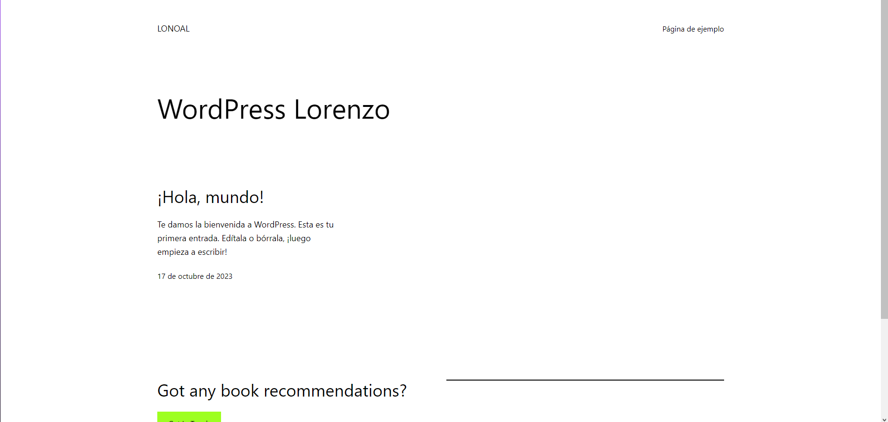

## Requisitos

- Docker: Asegúrate de que Docker esté instalado en tu sistema. Puedes descargarlo desde [https://www.docker.com/get-started](https://www.docker.com/get-started).

## Instrucciones


1. Crea archivo `docker-compose.yml` en un editor de texto. Este archivo define los servicios y la configuración necesaria para ejecutar WordPress en contenedores Docker.

   ```yaml
   version: '3.3'

    services:
        db:
            image: mysql:5.7
            ports:
                - "3307:3306"
        volumes:
            - db_data:/var/lib/mysql
        environment:
            MYSQL_ROOT_PASSWORD: somewordpress
            MYSQL_DATABASE: wordpress
            MYSQL_USER: wordpress
            MYSQL_PASSWORD: wordpress

    wordpress:
        depends_on:
            - db
        image: wordpress:latest
        ports:
            - "8000:80"
        volumes:
            - ./html:/var/www/html
        environment:
            WORDPRESS_DB_HOST: db:3306
            WORDPRESS_DB_USER: wordpress
            WORDPRESS_DB_PASSWORD: wordpress
            WORDPRESS_DB_NAME: wordpress
    volumes:
        db_data: {}
   ```

   Los parámetros más importantes en este archivo son:

   - `image`: Especifica la imagen Docker que se utilizará para cada servicio. En este caso, se utiliza la imagen oficial de MySQL para la base de datos y la imagen oficial de WordPress para el sitio web.

   - `ports`: Mapea los puertos del contenedor a los puertos del host. En este ejemplo, WordPress se ejecutará en el puerto 8080 de tu sistema.

   - `volumes`: Define los volúmenes Docker para persistir datos. En este caso, se utilizan dos volúmenes, uno para la base de datos y otro para los archivos de WordPress.

   - `environment`: Establece variables de entorno necesarias para la configuración de MySQL y WordPress, como contraseñas y nombres de bases de datos.

2. Una vez que hayas revisado y personalizado el archivo `docker-compose.yml`, ejecuta el siguiente comando para iniciar el entorno:

   ```bash
   docker-compose up -d
   ```

   Esto creará y ejecutará los contenedores en segundo plano.

3. Abre un navegador web y navega a `http://localhost:8080`. Deberías ver la página de configuración de WordPress.

4. Sigue las instrucciones en pantalla para completar la instalación de WordPress.

5. ¡Listo! Ahora deberías tener WordPress funcionando en tu sistema utilizando Docker Compose.

## Captura de pantalla

Adjunto una captura de pantalla de WordPress funcionando:



